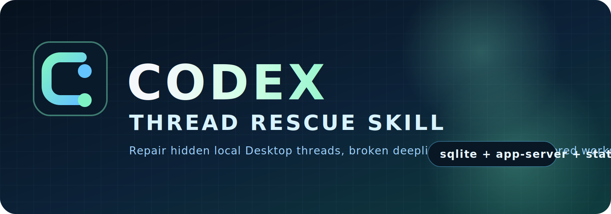

<p align="center">
  
</p>

# codex--thread-rescue--skill

Reusable Codex skill for repairing missing local project threads in Codex Desktop.

It targets the failure mode where old threads still exist in `state_5.sqlite`, but the Desktop sidebar and `codex://threads/<id>` deeplinks do not surface them for a workspace. In practice this often comes from provider-filtered thread visibility, stale global state pins, or both.

## Quick start

Fastest install:

```bash
git clone https://github.com/SpectrAI-Initiative/codex--thread-rescue--skill.git ~/.codex/skills/codex--thread-rescue--skill
```

If you already cloned the repo somewhere else:

```bash
python3 scripts/install_skill.py
```

Then restart Codex Desktop and ask Codex:

```text
Use $codex--thread-rescue--skill to restore missing local Codex Desktop threads for /absolute/path/to/project.
```

## What it includes

- `SKILL.md`: trigger metadata and operational workflow for Codex
- `agents/openai.yaml`: UI-facing metadata for skill lists and chips
- `scripts/install_skill.py`: one-command installer for local Codex skill setup
- `scripts/repair_codex_desktop_threads.py`: deterministic repair script

## What the script does

- Reads workspace threads from `$CODEX_HOME/state_5.sqlite`
- Compares database results against `codex app-server` `thread/list` visibility
- Detects hidden threads that exist in the DB but are filtered out of the default Desktop list
- Patches `$CODEX_HOME/.codex-global-state.json` so the workspace and thread metadata are visible to Desktop
- Optionally rewrites hidden `model_provider` rows to the currently visible provider after creating backups
- Optionally restarts Codex Desktop on macOS

## Install as a local skill

Clone or copy this repository to:

```text
~/.codex/skills/codex--thread-rescue--skill
```

After that, Codex can trigger the skill when a user asks to restore missing local Desktop threads.

The skill's internal name is also `codex--thread-rescue--skill`, so the repo name, install folder, and skill metadata stay aligned.

## Run manually

Dry run:

```bash
python3 scripts/repair_codex_desktop_threads.py --cwd /absolute/path/to/project
```

Apply repairs and relaunch Desktop:

```bash
python3 scripts/repair_codex_desktop_threads.py --cwd /absolute/path/to/project --apply --restart-desktop
```

JSON summary:

```bash
python3 scripts/repair_codex_desktop_threads.py --cwd /absolute/path/to/project --print-json
```

## Why it is safe

- Dry-run is the default. Nothing is modified unless `--apply` is provided.
- The repair script writes timestamped backups before it changes Desktop global state or the SQLite thread database.
- Provider rewrites only target threads that already exist for the same workspace but are hidden from Desktop's default list.
- You can inspect the JSON summary first with `--print-json` before applying anything.

## Compatibility

- Best suited for local Codex Desktop on macOS.
- The visibility check relies on `codex app-server`.
- On non-macOS setups, skip `--restart-desktop` and relaunch Desktop manually if needed.

## Notes

- The script is read-only unless `--apply` is provided.
- Before modifying state, it creates timestamped backups of the affected global state and SQLite database files.
- The current implementation is intended for local Codex Desktop setups on macOS.

## License

Apache-2.0. See `LICENSE`.
