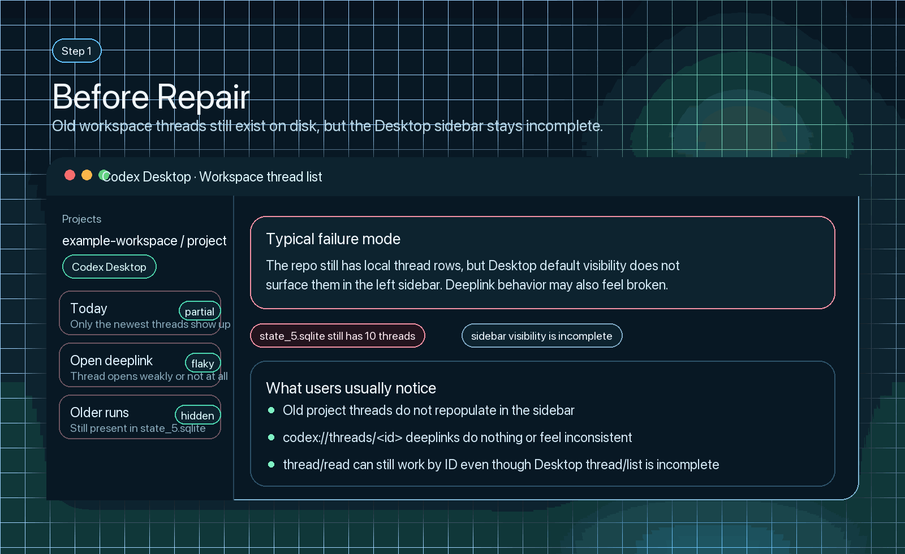
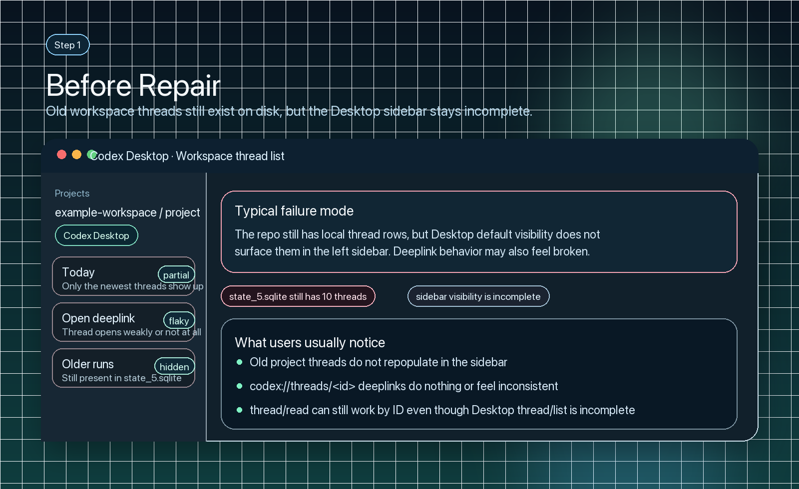
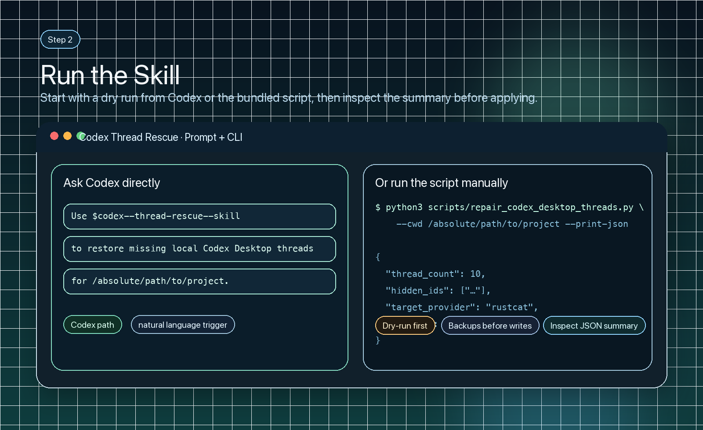
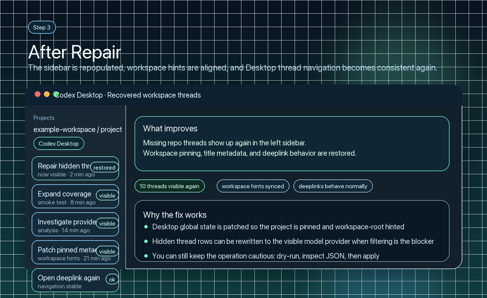

<p align="center">
  
</p>

# codex--thread-rescue--skill

Reusable Codex skill for repairing missing local project threads in Codex Desktop.

It targets the failure mode where old threads still exist in `state_5.sqlite`, but the Desktop sidebar and `codex://threads/<id>` deeplinks do not surface them for a workspace. In practice this often comes from provider-filtered thread visibility, stale global state pins, or both.

## Quick start

Fastest install:

```bash
git clone https://github.com/SpectrAI-Initiative/codex--thread-rescue--skill.git ~/.codex/skills/codex--thread-rescue--skill
```

If you already cloned the repo somewhere else:

```bash
python3 scripts/install_skill.py
```

Then restart Codex Desktop and ask Codex:

```text
Use $codex--thread-rescue--skill to restore missing local Codex Desktop threads for /absolute/path/to/project.
```

## Visual walkthrough

The panels below are sanitized walkthrough illustrations of the typical failure mode and repair flow. They are intentionally generic so the repository can explain the workflow without exposing private project names or real thread titles.

<p align="center">
  
</p>

**1. Before repair**

<p align="center">
  
</p>

The failure mode is usually obvious in the left sidebar first: only a partial set of recent threads appears even though older local threads still exist on disk.

**2. Invoke from Codex or CLI**

<p align="center">
  
</p>

Start with either the skill prompt or a manual dry run. The recommended path is still read-only first, with a JSON summary before any write.

**3. After repair**

<p align="center">
  
</p>

Once the repair is applied, the workspace thread list becomes visible again and Desktop navigation behaves consistently.

## What it includes

- `SKILL.md`: trigger metadata and operational workflow for Codex
- `agents/openai.yaml`: UI-facing metadata for skill lists and chips
- `assets/readme/*`: reproducible walkthrough visuals for the public README
- `scripts/install_skill.py`: one-command installer for local Codex skill setup
- `scripts/generate_readme_visuals.py`: regenerate the README walkthrough PNG and GIF assets
- `scripts/repair_codex_desktop_threads.py`: deterministic repair script

## What the script does

- Reads workspace threads from `$CODEX_HOME/state_5.sqlite`
- Compares database results against `codex app-server` `thread/list` visibility
- Detects hidden threads that exist in the DB but are filtered out of the default Desktop list
- Patches `$CODEX_HOME/.codex-global-state.json` so the workspace and thread metadata are visible to Desktop
- Optionally rewrites hidden `model_provider` rows to the currently visible provider after creating backups
- Optionally restarts Codex Desktop on macOS

## Install as a local skill

Clone or copy this repository to:

```text
~/.codex/skills/codex--thread-rescue--skill
```

After that, Codex can trigger the skill when a user asks to restore missing local Desktop threads.

The skill's internal name is also `codex--thread-rescue--skill`, so the repo name, install folder, and skill metadata stay aligned.

## Run manually

Dry run:

```bash
python3 scripts/repair_codex_desktop_threads.py --cwd /absolute/path/to/project
```

Apply repairs and relaunch Desktop:

```bash
python3 scripts/repair_codex_desktop_threads.py --cwd /absolute/path/to/project --apply --restart-desktop
```

JSON summary:

```bash
python3 scripts/repair_codex_desktop_threads.py --cwd /absolute/path/to/project --print-json
```

## Why it is safe

- Dry-run is the default. Nothing is modified unless `--apply` is provided.
- The repair script writes timestamped backups before it changes Desktop global state or the SQLite thread database.
- Provider rewrites only target threads that already exist for the same workspace but are hidden from Desktop's default list.
- You can inspect the JSON summary first with `--print-json` before applying anything.

## Compatibility

- Best suited for local Codex Desktop on macOS.
- The visibility check relies on `codex app-server`.
- On non-macOS setups, skip `--restart-desktop` and relaunch Desktop manually if needed.

## Repository checks

Run the same basic validation locally that GitHub Actions runs on every push and pull request:

```bash
python3 scripts/validate_skill.py
```

If you want to regenerate the README walkthrough PNG and GIF assets locally, install `Pillow` first:

```bash
python3 -m pip install Pillow
```

## FAQ

### I installed the repo, but the skill still does not show up in Codex Desktop

Make sure the installed folder is exactly `~/.codex/skills/codex--thread-rescue--skill`, then restart Codex Desktop. If you cloned the repo somewhere else first, run `python3 scripts/install_skill.py` from the repo root to copy the skill into the right place.

### Why do old threads exist on disk but not in the left sidebar?

This usually means Desktop visibility is filtering them out even though the thread rows still exist in `state_5.sqlite`. The most common causes are stale global state pins, missing workspace hints, or provider-filtered visibility.

### Is it safe to run?

Yes, the default mode is read-only. Use `--print-json` or a plain dry run first, then only add `--apply` if the summary matches what you expect. Before any write, the repair script creates timestamped backups.

### Do I need to use the script manually every time?

No. Once the repo is installed as a skill, you can ask Codex directly with a prompt like `Use $codex--thread-rescue--skill to restore missing local Codex Desktop threads for /absolute/path/to/project.`

### Does this work outside macOS?

Mostly yes for diagnosis and repairs, but the Desktop restart helper is macOS-oriented. On other systems, skip `--restart-desktop` and relaunch the app yourself if needed.

## Notes

- The script is read-only unless `--apply` is provided.
- Before modifying state, it creates timestamped backups of the affected global state and SQLite database files.
- The current implementation is intended for local Codex Desktop setups on macOS.

## License

Apache-2.0. See `LICENSE`.
